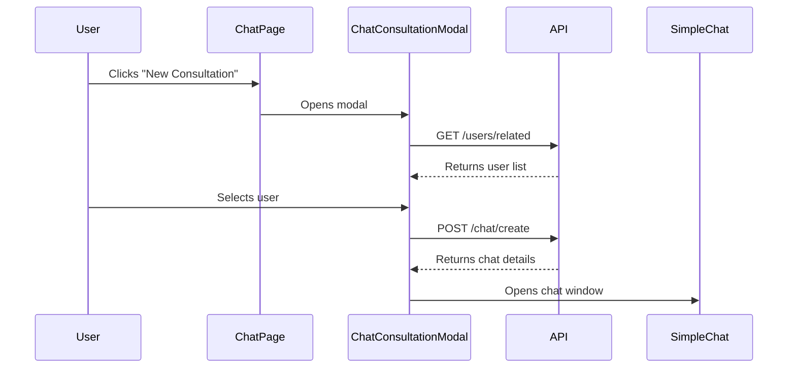
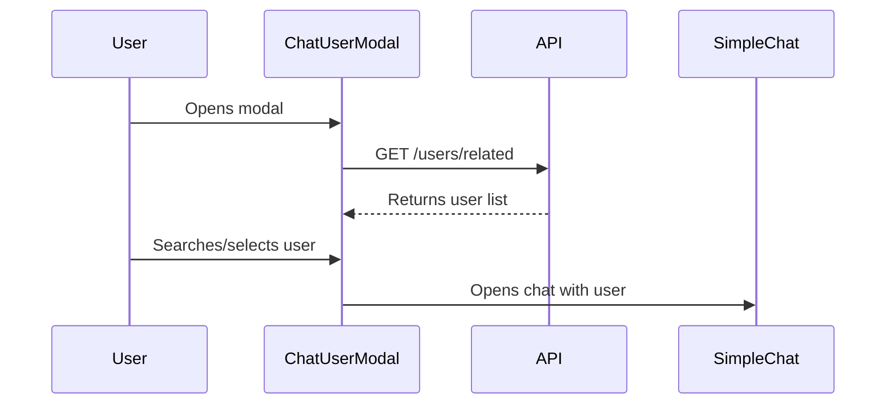

# Chat Consultation APIs

This document outlines the APIs and components related to the New Consultation button and Chat User Modal.

## Table of Contents
1. [New Consultation Button](#new-consultation-button)
2. [Chat User Modal](#chat-user-modal)
3. [API Endpoints](#api-endpoints)
4. [Component Flow](#component-flow)
5. [Data Types](#data-types)

## New Consultation Button

### Location
- **File**: `app/chat/page.tsx`
- **Component**: `ChatPage`

### Functionality
- Opens the `ChatConsultationModal` when clicked
- Triggers the chat flow for starting a new consultation

### Code Snippet
```tsx
<Button
  onClick={() => setIsConsultationModalOpen(true)}
  className="bg-primary hover:bg-primary/90 text-white gap-2"
>
  <Plus className="w-4 h-4" />
  {t("pages:consultation.newConsultation")}
</Button>
```

## Chat User Modal

### Location
- **File**: `components/modals/chat-user-modal.tsx`
- **Component**: `ChatUserModal`

### Props
```typescript
interface ChatUserModalProps {
  isOpen: boolean;
  onClose: () => void;
}
```

### Key Features
1. Fetches a list of users based on the current user's role
2. Allows searching and filtering users
3. Handles chat initialization with selected users
4. Integrates with the `SimpleChat` component

### User Interface Flow
1. User opens the modal
2. Modal fetches and displays a list of users
3. User can search for specific users
4. Clicking on a user starts a chat session
5. The `SimpleChat` component is displayed for the selected user

## API Endpoints

### 1. Get Related Users
- **Function**: `getRelatedUsers()`
- **File**: `lib/api/users-api.ts`
- **Description**: Fetches users based on the current user's role (clients for lawyers, lawyers for clients)
- **Authentication**: Required (uses JWT token)
- **Code**:
  ```typescript
  export async function getRelatedUsers() {
    const stringUser = localStorage.getItem("user");
    const user = stringUser ? JSON.parse(stringUser) : null;
    
    if (!user) {
      throw new Error("User not authenticated");
    }

    // Use dedicated endpoints based on user role
    if (user.account_type === 'lawyer') {
      return getClients();
    } else if (user.account_type === 'client') {
      return getLawyers();
    }
    
    throw new Error("Invalid user role");
  }
  ```

### 2. Get Clients (Lawyers Only)
- **Function**: `getClients()`
- **Endpoint**: `GET /clients` (from `endpoints.user.CLIENTS_LIST`)
- **Authentication**: Required (JWT token)
- **Response**:
  ```typescript
  {
    success: boolean;
    users: User[];
  }
  ```
- **Code**:
  ```typescript
  export async function getClients() {
    const token = getToken();
    const res = await fetch(endpoints.user.CLIENTS_LIST, {
      method: "GET",
      headers: {
        Authorization: `Bearer ${token}`,
        "Content-Type": "application/json",
      },
    });

    if (!res.ok) throw new Error(`Failed to fetch clients: ${res.statusText}`);
    const data = await res.json();
    return { success: true, users: data.clients || [] };
  }
  ```

### 3. Get Lawyers (Public)
- **Function**: `getLawyers()`
- **Endpoint**: `GET /lawyers` (from `endpoints.user.LAWYERS`)
- **Authentication**: Not required
- **Response**:
  ```typescript
  {
    success: boolean;
    users: User[];
  }
  ```
- **Code**:
  ```typescript
  export async function getLawyers() {
    const res = await fetch(endpoints.user.LAWYERS, {
      method: "GET",
      headers: {
        "Content-Type": "application/json",
      },
    });

    if (!res.ok) throw new Error(`Failed to fetch lawyers: ${res.statusText}`);
    const data = await res.json();
    return { success: true, users: data.data || [] };
  }
  ```

### 4. Get Clients and Lawyers (Admin)
- **Function**: `getClientsAndLawyers()`
- **Endpoint**: `GET /users/clients-and-lawyers` (from `endpoints.user.GET_CLIENTS_AND_LAWYERS`)
- **Authentication**: Required (JWT token)
- **Response**:
  ```typescript
  {
    success: boolean;
    clients: User[];
    lawyers: User[];
  }
  ```
- **Code**:
  ```typescript
  export async function getClientsAndLawyers() {
    const token = getToken();
    const res = await fetch(endpoints.user.GET_CLIENTS_AND_LAWYERS, {
      method: "GET",
      headers: {
        Authorization: `Bearer ${token}`,
      },
    });

    if (!res.ok) throw new Error("Failed to fetch users");
    return res.json();
  }
  ```

### 5. Create or Get Chat
- **Function**: `createOrGetChat(receiverId: string)`
- **Endpoint**: `POST /chat/create`
- **Authentication**: Required (JWT token)
- **Purpose**: Creates a new chat or returns an existing one with the specified user
- **Payload**:
  ```typescript
  {
    receiverId: string;  // ID of the user to chat with
  }
  ```
- **Response**:
  ```typescript
  {
    _id: string;        // Chat ID
    participants: string[]; // Array of user IDs
    createdAt: string;
    updatedAt: string;
  }
  ```
- **Used in**: `handleStartChat` functions in both modals

## Component Flow

### 1. New Consultation Flow


### 2. Chat User Modal Flow


## Data Types

### User Type
```typescript
interface User {
  _id: string;
  first_name: string;
  last_name: string;
  email: string;
  account_type: "client" | "lawyer";
  pratice_area?: string;
  experience?: string;
  is_active: number;
  profile_image?: string;
  chat_rate?: number;
  video_rate?: number;
}
```

### Chat Type
```typescript
interface Chat {
  _id: string;
  participants: string[];
  lastMessage?: string;
  unreadCount?: number;
  createdAt: string;
  updatedAt: string;
}
```

## Related Files
- `app/chat/page.tsx` - Main chat page with New Consultation button
- `components/modals/chat-consultation-modal.tsx` - Consultation modal component
- `components/modals/chat-user-modal.tsx` - User selection modal
- `components/chat/simple-chat.tsx` - Chat window component
- `lib/api/users-api.ts` - API functions for user-related operations
- `lib/api/chat-api.ts` - Main chat API functions
